# ADX rp2040 Digital Transceiver (ADX_rp2040)

# Overview

A brief story of the project start with the excelent ADX Transceiver from Barb (WB2CBA) which can be found at

* Github site [link](http://www.github.com/WB2CBA/ADX).
* ADX transceiver blog [link](https://antrak.org.tr/blog/adx-arduino-digital-transceiver)

The ADX transceiver is powered by an Arduino Nano (ADX) or Arduino Uno (ADX_UNO) boards using both the 
ATMEL ATMEGA382p processor.

In order to leverage the capabilities of the transceiver with a powerful processor such as the Raspberry Pi Pico
which uses the rp2040 architecture this project was started.

Then a map between the Arduino board I/O and the rp2040 I/O was made showing some differences needs to be addressed
which requires additional circuitry.

Once the hardware platform was defined the firmware was ported using the ADX_UnO_V1.3 firmware as a baseline, the
porting didn't introduce any new feature or function, just the minimum number of changes to the code to accomodate
the architecture differences between both platforms.


# Hardware


I started the porting of the firmware assuming an ADX transceiver board, no more but no less features, but being powered
 by a Raspberry Pico board; the porting of the software was a great deal of a learning curve not only for the rp2040
 architecture being different from the ATMEGA382p and being more powerful, but also a substantially different build chain
 which in some cases is implementing partially some features. For migration purposed the Raspberry Pi Pico board was used.

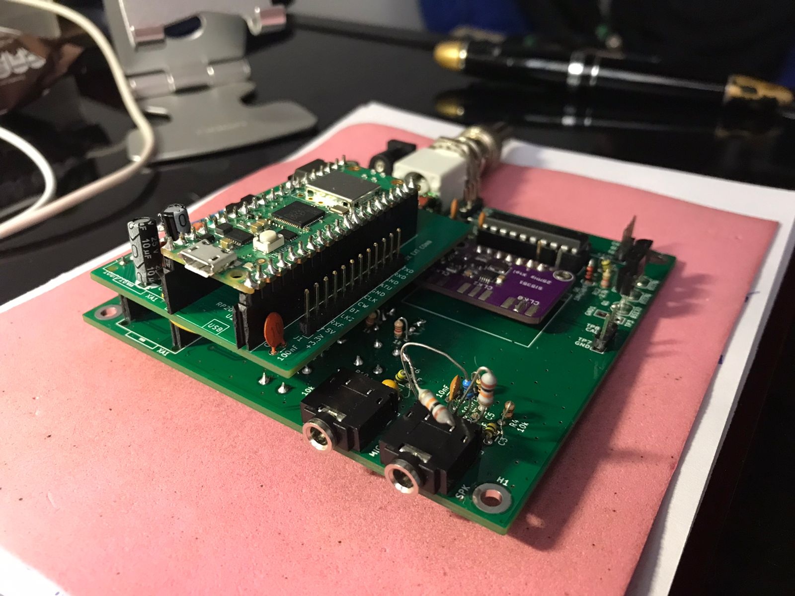 

Although the first version of the new transceiver board was made after a wired (but functional) version of it Barb helped
 very substantially by creating the PCB design for the ADX2PDX board (included in this site).


The ADX2PDX daughter board connect with an ADX board with minimal modifications using the Arduino Nano socket and provides
 a functionality similar to the main board.

This approach allows an existing ADX board to be upgraded with the new processor but to develop either a wired prototype
 or a custom board using the rp2040 processor instead of the ATMEGA328p are also options.

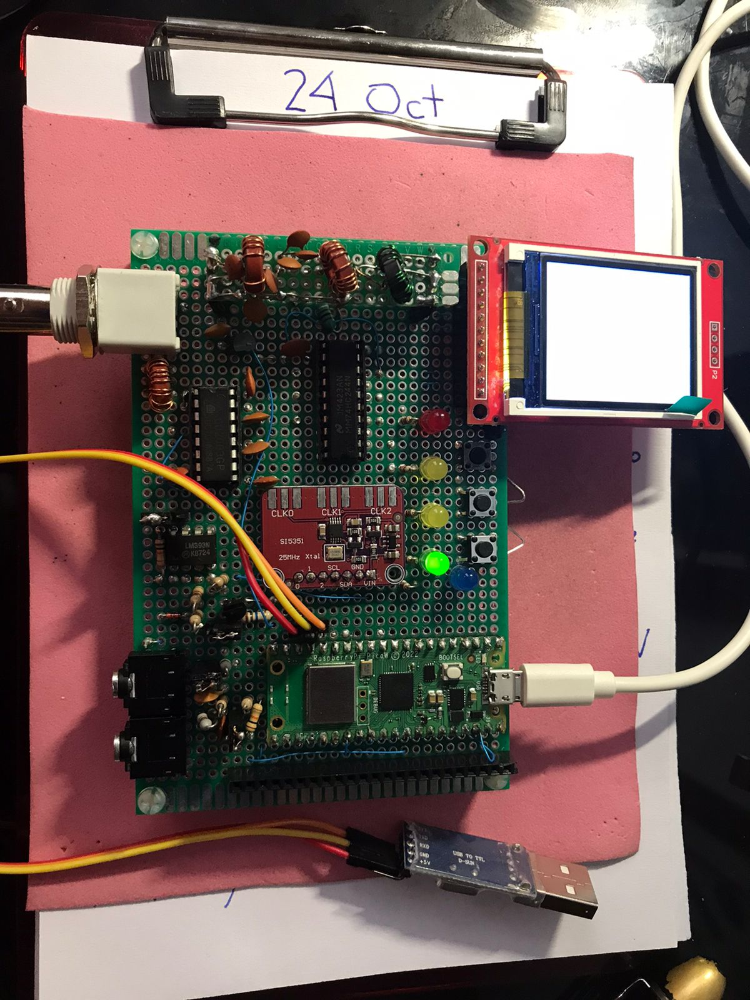 

```
Warning!
At this time the ADX 2 PDX board is under test, the unit test of the firmware has been conducted with a full wired
version of the transceiver shown in a picture above.  The TFT LCD display and serial debug shown in the picture are for development
 purposes only and aren't supported by the distributed firmware.
```

# Firmware
## Build environment

The development environment used is the Arduino IDE, even with some limitations it's far more easy to setup and operate
than the Eclipse IDE alternative and present a much smoother transition from development for the Arduino environment into
the rp2040 environment.

The usage of the Arduino IDE is based on the [arduino pico core libraries developed by Earle F. Philhower, III](https://github.com/earlephilhower/arduino-pico).

In order to install it a tutorial can be found [here](https://www.tomshardware.com/how-to/program-raspberry-pi-pico-with-arduino-ide) or 
[here](https://www.upesy.com/blogs/tutorials/install-raspberry-pi-pico-on-arduino-ide-software).

## Pre-requisites and libraries

In order to build the firmware some libraries are needed, the dependencies are shown as follows

Basic support

* Earl E Philhower rp2040 core porting to Arduino IDE (https://github.com/earlephilhower/arduino-pico)
* SI5351 Library by Jason Mildrum (NT7S) - https://github.com/etherkit/Si5351Arduino
* Arduino "Wire.h" I2C library(built-into arduino ide)
* Arduino "EEPROM.h" EEPROM Library(built-into arduino ide)

Code excerpts gathered from manyfold sources to recognize here, large pieces of code were extracted from former projects

* [PixiePi](https://github.com/lu7did/PixiePi).
* [Pixino](https://github.com/lu7did/Pixino).
* [OrangeThunder](https://github.com/lu7did/OrangeThunder).

## Code structure

The main functionality is quite similar to the baseline ADX firmware used, there are three changes needed to adapt the firmware to the rp2040
architecture.

* I/O.
 A mapping between the Arduino I/O pin and the rp2040 GPIO ports has been made, symbolic names were adjusted and coding macros used to replace
the primitives to operate it. Proper initialization was initroduces for all ports used.

* EEPROM.
The rp2040 based Raspberry Pi Pico board used to host the porting doesn't have EEPROM available, however the arduino core is able to emulate it
on flash memory, however additional definitions to initialize and commit values is needed and thus included in the ported code.
 
* Tone frequency counting.
The rp2040 processor lacks the zero cross comparator interrupt used by the ADX transceiver and thus it has been replaced using a firmware
definition on one of the PIO of the processor (RISC processor).

The code port was made starting with the [ADX_UnO_V1.3](https://github.com/WB2CBA/ADX-UnO-V1.3) as available at the GitHub site by Nov,15th 2022,
no automatic synchronization mechanism has been established with it. The overall logic cycle of the firmware can be seen in the following figure.
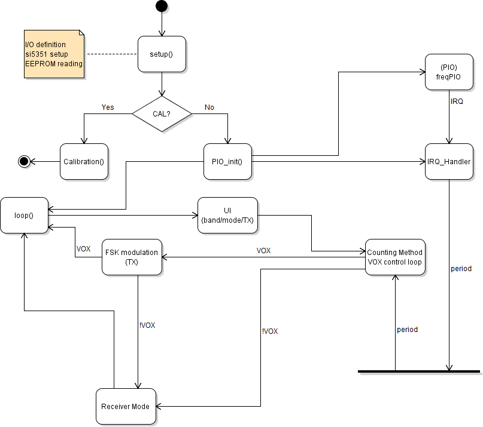

The main functionality is contained in the file ADX_rp2040.ino which is compiled by using the Arduino IDE supplied with the stated
libraries, different subsystems are made dependent on configuration directives (#define on the microcode, typically to signal the
introduction of a porting segment by means of the #define RP2040 directive) which mades the relevant code segments  to be included
or excluded from the build process.

```
mandatory files

ADX_rp2040.ino

PIO programming (counting method)

freqPIO.cpp
freqPIO.pio
freqPIO.pio.h


```


### Transmission Algorithms

The ADX transceiver by Barb (WB2CBA) owes in part it's popularity to it's simplicity, and no small part of it derives from the very simple, yet effective, way
to process incoming audio signals to derive that is the PSK tone currently being sent by the host program and direct the transmitter to operate at a base
frequency plus that tone frequency in order to achieve direct synthesis USB transmission with a very low overhead mechanism which involves little or no
DSP programming which can be very taxing for the original Arduino board the transceiver has been designed with.
The algorithm comes actually from Burkhard Kainka (DK7JD) [link](http://elektronik-labor.de/HF/SDRtxFSK2.html) cleverly uses the COMPA timer of the 
ATMEGA328p processor architecture into a very effective frequency meassurement with very little overhead, hardly can be considered a DSP processing, then
the information of the frequencies is applied to the frequency output to achieve the digital modulation desired. This can be made because this is a digital
transceiver and it's assumed it's used to transmit some form of a weak signal mode such as WSPR, JS8, FT4 or FT8, it can be used for CW and in general with
some limitations for any mode where the amplitude carries no information.
Unfortunately the rp2040 doesn't have such a good resource, so the frequency needs to be measured using other strategy, this in turns become a great source
of experimentation.


A PIO processor is configured to generate an interrupt with the rising flank of the signal, a high resolution timer (capable of +/- 1 uSec resolution)
is used to compute how many ticks can be counted between two sucessive flanks. There is actually no "zero crossing" detection as the GPIO isn't capable to
trigger interruptions with that condition, but it's triggered when the signal level achieves the ON condition of the input pin. It's assumed the trigger level
is the same for all cycles at it is not a signal subject to fading, therefore the frequency can be counted by measuring the time elapsed between similar parts of sucessive cycles.
In order for the algorithm to work a signal conditioning needs to be performed by means of external hardware, this can be made either thru a MOSFET or an IC comparator based
 circuit (see hardware for details).
The actual measurement accuracy is in the order of +/- 2 Hz in the worst case, which is accurate enough for digital modes.


```

Sources of error

The counting has +/- 2 Hz error as the start and end of the counting window might include or exclude the starting and ending cycles. Also
the trigger point might suffers some variations making the actual timing between sucessive cycles inaccurate. Finally the SNR of the signal
might present noises which trigger false counts.

```


# Hardware

The hardware required by this transceiver derives directly from the ADX Transceiver (WB2CBA), the implementation can take basically two forms:

* Build a hand wired version of the circuit.
* Build an ADX transceiver and replace the Arduino Nano with the ADX2PDX daughter board created by Barb (WB2CBA), see below.

## ADX_rp2040 circuit

The circuit used is esentially the ADX transceiver with the minimum set of modifications to accomodate a Raspberry pico (rp2040 processor) instead of an
 Arduino Nano (ATMEGA328p processor).
The following diagram has been originally conceived by Dhiru (VU3CER) and put together by Barb (WB2CBA):

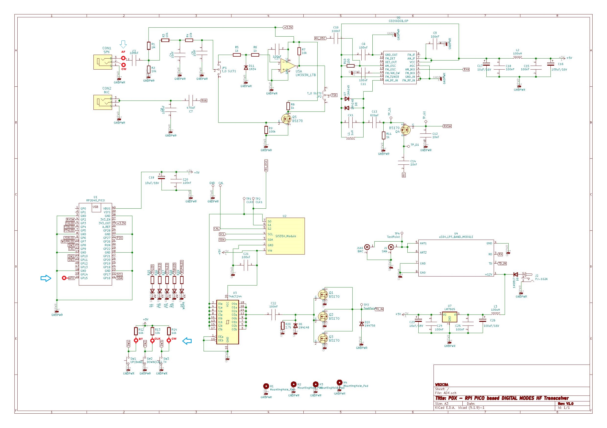
PDX_V1.0_Schematic.jpg

The receiver, Si5351 clock, RF driver and final stages are identical to the standard ADX Transceiver, whilst changes are made around the rp2040 processor to
accomodate the different signaling and voltages used.


### rp2040 pinout assignment
For circuit design and future expansion several assignmentes has been made on the rp2040 pinout for the following assignment assignment


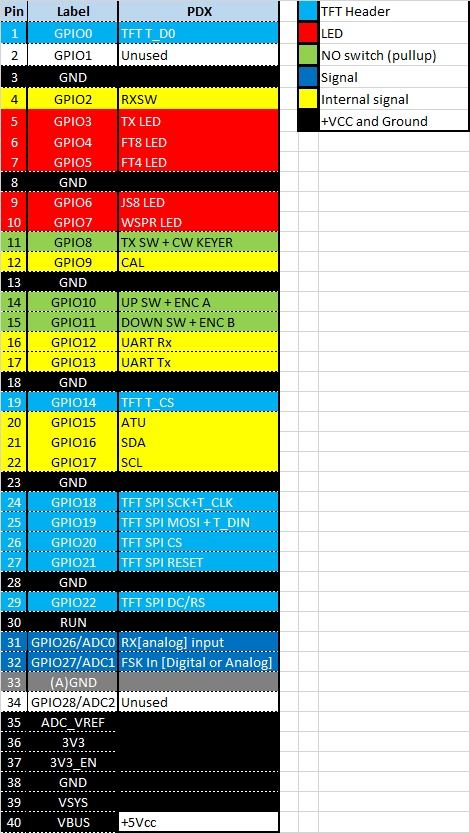


### Power supply

The Raspberry Pi Pico operates with +3.3V logic as opposed to the Arduino Nano used by the ADX transceiver, still it has an internal +5V/+3.3V regulator which
is used by the design. 
The standard +12Vcc voltage is used to feed only the final amplifier (3xBS170), a +12Vcc/+5Vcc regulator is used to obtain the voltage to feed the Raspberry
Pico (VSYS) pin, the +3.3Vcc obtained from the board is then used to feed the receiver logic, the Si5351 clock, the 74ACT244 RF driver and the CD2003GP based 
receiver as well as the miscellaneous circuitry such as LED indicators, switches and signal comparator.

### Switches
Like the standard ADX transceiver the design carries three (3) push (normally open) switches to signal:

* UP up mode, up band in band setting mode and up frequency in CW mode. Also used to signal the start of the calibration mode on start-up (see below).
* DOWN down mode, down band in band setting mode and down frequency in CW mode. Also used to signal start of serial configuration terminal on start-up (see below).
* TX transmit mode, manually set the transceiver in transmission mode, also keyer in CW mode.

```
¡WARNING!
The three resistors pulling up the switch voltage from +5Vcc in the ADX transceiver **needs to be omitted (not populated)**
on the PDX transceiver as they will feed the corresponding GPIO pins with +5Vcc instead of +3.3Vcc and might result in the
**damage** of the processor. The firmware uses internal pull up resistors to replace them.
```

### LED

Like the standard ADX transceiver the design carries four (4) LED to signal the transceiver state:

* WSPR LED, to signal WSPR mode, band1 in band setting operation, calibration mode and terminal mode. Also frequency indicator in CW mode.
* JS8 LED, to signal JS8 mode, band2 in band setting operation, end of calibration mode and terminal mode. Also frequency indicator in CW mode.
* FT4 LED, to signal FT4 mode, band3 in band setting operation, end of calibration mode and terminal mode. Also frequency indicator in CW mode.
* FT8 LED, to signal FT8 mode, band4 in band setting operation, end of calibration mode and terminal mode. Also frequency indicator in CW mode.
* TX LED, to signal transmission, band setting operation, end of calibration mode and terminal mode, watchdog activated, also keying in CW mode.
```
¡WARNING!
Due to the smaller drawing capability and lower output voltage of the GPIO pins 3mm red LED are recommended for all four.
```

### Si5351

Operation of the Si5351 clock generator is identical as in the ADX transceiver with minor differences, it's being used as:

* CLK0, receiver oscillator.
* CLK1, transmitter oscilator and FSK generator.
* CLK2, calibration reference signal.

```
¡WARNING!
The calibration process is manual as per the ADX transceiver (see the original method as described on Barb's web page and blog), the hardware
support a future implementation of an automatic calibration procedure which isn't been implemented in the firmware.
```

### Receiver

The receiver sub-system is identical than the ADX Transceiver.

### RF Power 

The RF power (driver and finals) is identical than the ADX Transceiver.


### Low Pass Filter

The Low Pass Filter (actually more than that) is needed to suppress unwanted spurious responses and also to achieve high efficiency class E operation.
The design is identical than the ADX Transceiver.


#### MOSFET based comparator

This is the simplest one as the incoming signal, close to a senoidal form is used to trigger the conduction of a simple MOSFET, the resulting signal is
as follows as measured in the drain of the MOSFET (JP2-1)

, MOSFET")

Some mods are needed in both the PDX board and the ADX board for this comparator to properly work:

```
Modifications on the PDX board or ADX board or ADX2PDX board.
* R1 needs to be changed to 10K.
* JP1 needs to be shorted between pins 2-3.
* JP2 needs to be shorted between pins 1-2.
```


### ADX2PDX daughter board

Barb (WB2CBA) created a small daughterboard, dubbed as ADX2PDX, which can be used to transform a standard ADX transceiver into a PDX transceiver with 
minimal modifications.

The daughterboard schematic is as follows:

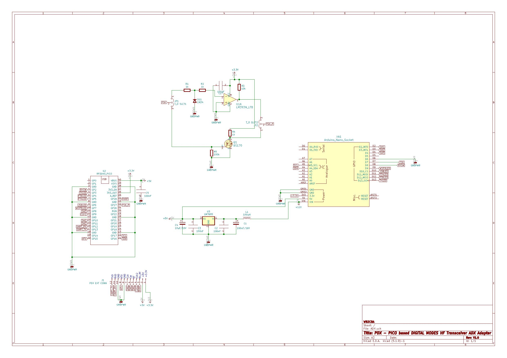

```
¡WARNING!
**ADX2PDX daughter board is still under development and test**
```


```
¡WARNING!
In order to accomodate the daughterboard on top of the standard ADX board some construction modifications are recommended:
* Bend L2,C16,C17 and C19 as they are large components with might interfere with the daughterboard.
* Use a 2x pin strip (female) instead of a socket for the Arduino nano as it creates better grip of the daughter board.
* Remove R12,R13 and R14 to avoid +5Vcc to reach the GPIO pins of the rp2040 rated for operation at +3.3V and prevent potential damage. 
```

```
Construction note
For building flexibility both the MOSFET and CI based comparators are provided in the daughter board but only one
must be connected, even if both can physically be present the selections of the JP1 and JP2 jumpers will define
which one is actually used.
```

# Testing

The testing of the project requires several steps before being released as an *alpha* version

```
Test Setup
   ADX-rp2040 running on PDX V1.0 wired prototype (LT7D), WSJT-X on a MacOS. 
		MOSFET comparator JP1 2-3 && JP2 1-2
                Oscilloscope UNI-T UTD2052CL 50 MHz
                 
   ADX-QUAD-V1.5 running on a ADX transceiver, WSJT-X on a Raspberry Pi
   **ADX2PDX daughter board NOT tested as it is still under development and test**
```

* Unit test.
The following tests were performed with DEBUG mode on (#define DEBUG 1):


*	Initialization sequence.
*	Mode change (UP/DOWN sequences).
*	Band change (UP/DOWN sequences).
*	Transmission mode.
*	Recover of changed values on next startup (EEPROM saving)

* Integration test.

*	Audio in, FSK in 
Using WSJT-X as a 1800 Hz tone generator, Channel 1 Audio in (AF), Channel 2 Comparator out (FSK)
Verified voltage levels and operation of the VOX algorithm 
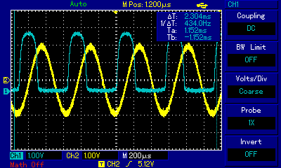

*	Si5351 operation, transmission (CLK0 signal, 7.074 MHz, high level)
Using WSJT-X as a 1800 Hz tone generator, Channel 1 Si5351 CLK0 (TX), pressing the TX button
Verified voltage levels and frequency of the clock 

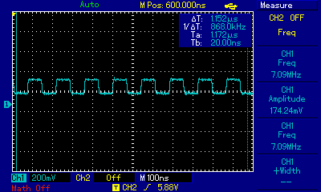

*	Si5351 operation, reception (CLK1 signal, 7.074 MHz, low level).
Using WSJT-X as a 1800 Hz tone generator, Channel 1 Si5351 CLK1 (RX), *not* pressing the TX button
Verified voltage levels and frequency of the clock 
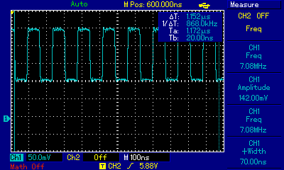

*	Si5351 operation, calibration (CLK2 signal, 1 MHz, low level).

*	Calibration (enter calibration mode, UP/DOWN to calibrate, save in EEPROM).

* Communication test.

*	Communication, send 1800 Hz tone.
Using WSJT-X as a 1800 Hz tone generator, sent TEST TONE 1800 Hz

*	Communication, reception of 1200 Hz tone.
Using WSJT-X as a 1800 Hz tone generator, received TEST TONE 1800 Hz (generated by another station)

* On the air test (OTA)
*	Communication, Answer a CQ from other station.
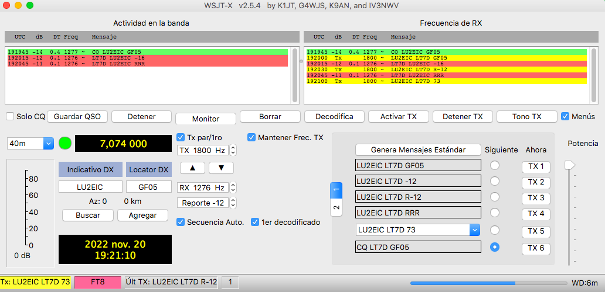

*	Communication, Send a CQ and being answered by another station.
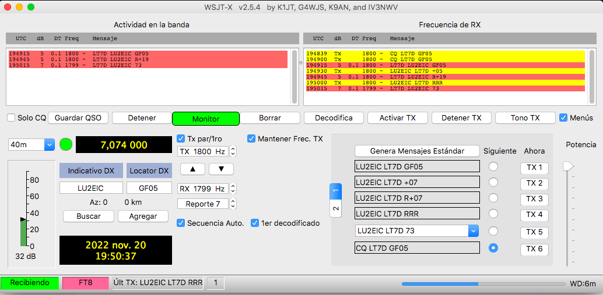

