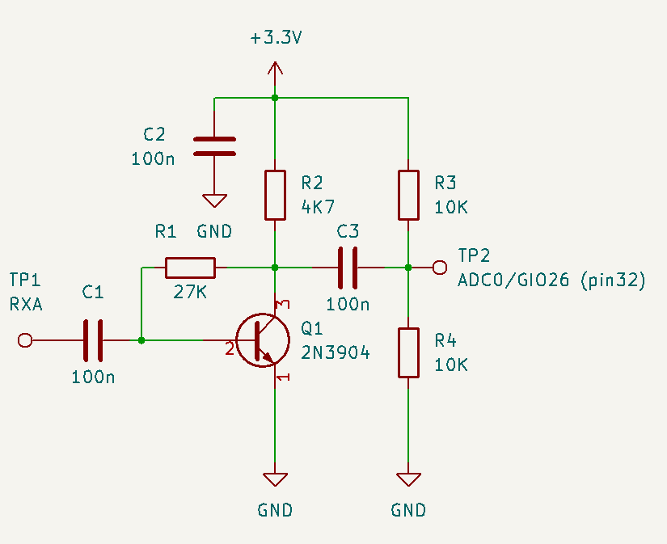

# RDX rp2040 Digital Transceiver (RDX_rp2040)

# Overview to Version 2.0

A brief story of the project start with the excelent ADX Transceiver from Barb (WB2CBA) which can be found at

* Github site [link](http://www.github.com/WB2CBA/ADX).
* ADX transceiver blog [link](https://antrak.org.tr/blog/adx-arduino-digital-transceiver)

The ADX transceiver is powered by an Arduino Nano (ADX) or Arduino Uno (ADX_UNO) boards using both the 
ATMEL ATMEGA382p processor.

In order to leverage the capabilities of the transceiver with a powerful processor such as the Raspberry Pi Pico
which uses the rp2040 architecture this project was started.

Then a map between the Arduino board I/O and the rp2040 I/O was made showing some differences needs to be addressed
which requires additional circuitry.

Once the hardware platform was defined the firmware was ported using the ADX_UnO_V1.3 firmware as a baseline, the
porting didn't introduce any new feature or function, just the minimum number of changes to the code to accomodate
the architecture differences between both platforms.

This is a special experimental firmware able to operate as an autonomous transceiver by decoding and
generating FT8 signals without the usage of an external program such as WSJT-X

```
*New in release 2.0 *

* Initial experimental release, for evaluation purposes only
* Automatic FT8 operation.
* TFT LCD 480x320 support.
```


# Hardware

Same hardware than the supported by the ADX-rp2040 firmware with the following additions.

*	Audio amplifier (see modifications).
*	TFT LCD IL99488 480x320 board (see wiring). 


# Firmware
## Build environment

Same build environment than the one used by the ADX-rp2040 firmware plus:


## Pre-requisites and libraries

Same build environment than the one used by the ADX-rp2040 firmware plus the following libraries:

*	[TFT_eSPI](https://github.com/Bodmer/TFT_eSPI) Library by Bodmer
*	[TFT_eWidget](https://github.com/Bodmer/TFT_eWidget) Library by Bodmer 

Code excerpts gathered from manyfold sources to recognize here, large pieces of code were extracted from former projects

* [PixiePi](https://github.com/lu7did/PixiePi).
* [Pixino](https://github.com/lu7did/Pixino).
* [OrangeThunder](https://github.com/lu7did/OrangeThunder).

## Code structure

Experimental, yet to be documented.

## Time synchronization

To operate using FT8 the transmission and reception must be synchronized in time among all operator with a tolerance of less than 2 seconds. The rp2040 lacks a 
real time clock (RTC), it keeps track of the time quite precisely but starting from the boot moment, which in turn might happen at any arbitrary time, therefore 
rendering the board unusable for FT8 decoding and emitting pursposes.

There are several strategies to address this problem:

*	Using an external RTC board that can be synchronized with an external clock source.
*	Using a GPS receiver to synchronize the time.
*	Using the NTP protocol over the Internet to synchronize with a time server.
*	Some manual way to synchronize the time.

At this point the later strategy is the selected, if not because it's the simplest and quickest to implement. Upon startup the rp2040 board starts it's internal
clock is set arbitrarly. However, if the UP button is found pressed while performing the initial firmware setup the processing is held (all LEDs blinking
signals that situation). The button can be held pressed until the top of the minute and when released the internal clock is set to 00:00:00 and therefore
left synchronized.

To operate FT8 the actual time isn't needed, other administrative pursposes such as a log might require that, but the protocol itself needs to identify within a 1 sec
precision the seconds 0,15,30 and 45 of each minute; once synchronized the internal clock is precise enough to do that.

The synchronization is volatile and therefore needs to be performed everytime the board is powered, but it can be done with any celular phone or other precise time
source (synchronized with a time server) where the second 00 of each minute can be precisely spot.

```
Warning

Although the internal clock is synchronized few microseconds after the release of the UP button the actual synchronization is an eye-hand coordination
that could take some hundred milliseconds up to over a second; in some cases the synchronization isn't good enough, and that can be seen as a difficulty
to properly decode signals or have a reduced sensitiviy to small signals. In that case the best cure is to repeat the synchronization.
However a simple method is to use a clock which actually is digital but has an analog format, when the seconds handle crosses the "1" of the "12" mark the button
must be released, this will account for some differences in the reaction time to do that and thus enhance the synchronization process. 
```


# Hardware

The hardware required by this transceiver derives directly from the ADX Transceiver (WB2CBA), the implementation can take basically two forms:

* Build a hand wired version of the circuit.
* Build an ADX transceiver and replace the Arduino Nano with the ADX2PDX daughter board created by Barb (WB2CBA), see below.

## ADX_rp2040 circuit


The circuit used is esentially the ADX transceiver with the minimum set of modifications to accomodate a Raspberry pico (rp2040 processor) instead of an
 Arduino Nano (ATMEGA328p processor).
The following diagram has been originally conceived by Dhiru (VU3CER) and put together by Barb (WB2CBA):


PDX_V1.0_Schematic.jpg

Check additionally mods required and TFT support requirements detailed below.

The receiver, Si5351 clock, RF driver and final stages are identical to the standard ADX Transceiver, whilst changes are made around the rp2040 processor to
accomodate the different signaling and voltages used.


### rp2040 pinout assignment

Same as the ADX-rp2040 project


### Power supply

Same as the ADX-rp2040 project

### Receiver

The receiver sub-system is identical than the ADX Transceiver.

### RF Power 

The RF power (driver and finals) is identical than the ADX Transceiver.

### Low Pass Filter

The Low Pass Filter (actually more than that) is needed to suppress unwanted spurious responses and also to achieve high efficiency class E operation.
The design is identical than the ADX Transceiver.


### ADX2PDX daughter board

Same as the ADX-rp2040 project


## RDX-rp2040 modifications

The following modifications applies to both the schematic of the RDX transceiver or the ADX2PDX daughterboard.
```

 * Build a small class A audio amplifier.
 * Connect the input of the amplifier to RXA.
 * Connect the output of the amplifier to GPIO26 (ADC0) pin 31 of the rp2040 board.

```
A suitable circuit can be seen in the following schematic




## TFT LCD display support

The firmware supports a TFT LCD IL9488 480x320 display where a GUI is presented allowing the operation of the transceiver, the LCD is optional
but it greatly enhances the autonomous FT8 operation allowing to see the activity on the channel and operate either to call CQ or answer to
an on-going call.

The actual wiring of the TFT board needs to connect the pinout to the Raspberry Pico (rp2040) processor as indicated in the following
diagram:


## ADX2PDX daughter board prototype fixes

Same as the ADX-rp2040 project

## ADX2PDX PCB

Same as the ADX-rp2040 project


# Testing

Only preliminar testing has been performed as it is just an evaluation version of the firmware, functions will be
tested as the implementation evolves.
