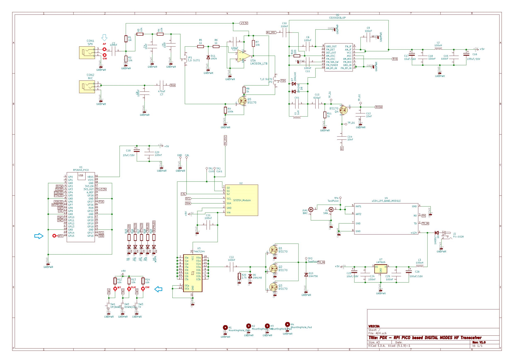
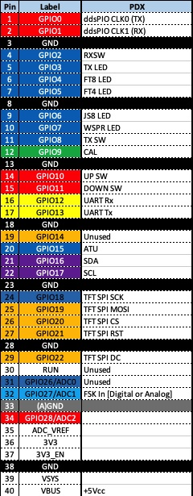

# RDX rp2040 Digital Transceiver (RDX_rp2040)

# Overview to Version 2.0 (Alpha)

A brief story of the project start with the excelent ADX Transceiver from Barb (WB2CBA) which can be found at

* Github site [link](http://www.github.com/WB2CBA/ADX).
* ADX transceiver blog [link](https://antrak.org.tr/blog/adx-arduino-digital-transceiver)

The ADX transceiver is powered by an Arduino Nano (ADX) or Arduino Uno (ADX_UNO) boards using both the 
ATMEL ATMEGA382p processor.

In order to leverage the capabilities of the transceiver with a powerful processor such as the Raspberry Pi Pico
which uses the rp2040 architecture this project was started.

Then a map between the Arduino board I/O and the rp2040 I/O was made showing some differences that need to be addressed
requiring additional circuitry, hardware modifications and firmware support.

Once the hardware platform was defined the firmware was ported using the ADX_UnO_V1.3 firmware as a baseline, the
porting didn't introduce any new feature or function, just the minimum number of changes to the code to accomodate
the architecture differences between both platforms. The firmware version emerging from that initial effort
can be found as the [ADX-rp2040](https://github.com/lu7did/ADX-rp2040/tree/master/src/ADX-rp2040) firmware version in this
site.		

Continuing with the roadmap of the project an experimental firmware able to operate as an autonomous transceiver by decoding and
generating FT8 signals **without** the usage of an external program such as WSJT-X was created, documentation of the
features on this project called **RDX**, standing for **Raspberry Pico Digital Transceiver**, are documented in this branch of the site.

```
*New in release 2.0 *

* Initial alpha release, for experimentation purposes only
* Automatic FT8 operation.
* TFT LCD 480x320 support.
* Autocalibration mode has been added check the appropriate section on how to enable and operate.
* NTP protocol based time synchronization.
* Web browser console (access to File System in Flash memory).
* Improvements in the FT8 protocol handling cycle.
* GUI development.
* ADIF logbook generation.
* USB ADIF logbook export.
```


# Hardware

Same hardware than the supported by the ADX-rp2040 firmware,  with the following additions.


*	Audio amplifier (see modifications).
*	TFT LCD IL9488 480x320 board (see wiring). 


# Firmware
## Build environment

Same build environment than the one used by the ADX-rp2040 firmware plus:


## Pre-requisites and libraries

Same build environment than the one used by the ADX-rp2040 firmware the latest version of the [Arduino pico core](https://github.com/earlephilhower/arduino-pico)
by Earle F. Philhower III  plus the following libraries:


*	[TFT_eSPI](https://github.com/Bodmer/TFT_eSPI) Library by Bodmer
*	[TFT_eWidget](https://github.com/Bodmer/TFT_eWidget) Library by Bodmer 

Code excerpts gathered from manyfold sources to recognize here, large pieces of code were extracted from former projects

* [PixiePi](https://github.com/lu7did/PixiePi).
* [Pixino](https://github.com/lu7did/Pixino).
* [OrangeThunder](https://github.com/lu7did/OrangeThunder).

## Code structure

### Overall FT8 decoding logic

The following UML graphic shows at high level the FT8 decoding cycle


### FT8 protocol finite state machine

The following UML graphic shows at high level the FT8 finite state machine controlling the behaviour of the 
transceiver during the FT8 QSO cycle.


## Automatic calibration (autocalibration)

Starting on version 2.0 build(23) and higher a new capability to perform an automatic calibration of the Si5351 VFO has been added.

### Enabling

The firmware allows the automatic calibration of the Si5351 dds using the following procedures.

### Operation

When started the firmware will look during the setup stage if the **DOWN** pushbutton is pressed, if so all the on-board LEDs will
be lit with the exception of the TX LED indicating a waiting pattern, the autocalibration procedure will start as soon as the push
 button is released.

If the board is powered off before the push button is released the previous calibration stored in EEPROM (flash memory) will be reset
to zero.

The calibration can be monitored either by the LED pattern exhibited or thru the USB serial port (Arduino IDE Serial Monitor), once
the calibration is completed the results will be written in EEPROM (flash memory) as in the manual calibration in order to be used
on sucessive starting cycles. While the calibration is being performed the TX LED will blink once per second, the rest of the
board LEDs will mark how large is currently the difference in the calibration mode:

```
         WSPR,JS8,FT4,FT8 lit       error > 75 Hz
         WSPR,JS8,FT4     lit       error > 50 Hz
         WSPR,JS8         lit       error > 25 Hz
         WSPR             lit       error > 10 Hz
         All LED off                error < 10 Hz  (final convergence might take few seconds more)
```

When monitoring the calibration thru the USB Serial monitor the messages will look like:
```
Autocalibration procedure started
Current cal_factor=0
Current cal_factor=0, reset
Si5351 clock setup f 1000000 MHz
n(12) cal(1000000) Hz dds(1000071) Hz err (71) Hz factor(0)
n(12) cal(1000000) Hz dds(1000074) Hz err (74) Hz factor(500)
.............[many messages here]................
n(11) cal(1000000) Hz dds(1000001) Hz err (1) Hz factor(71500)
n(10) cal(1000000) Hz dds(1000001) Hz err (1) Hz factor(71500)
n(9) cal(1000000) Hz dds(1000001) Hz err (1) Hz factor(71500)
n(8) cal(1000000) Hz dds(1000002) Hz err (2) Hz factor(71500)
n(8) cal(1000000) Hz dds(1000000) Hz err (0) Hz factor(72000)
n(7) cal(1000000) Hz dds(1000001) Hz err (1) Hz factor(72000)
n(6) cal(1000000) Hz dds(1000001) Hz err (1) Hz factor(72000)
n(5) cal(1000000) Hz dds(1000001) Hz err (1) Hz factor(72000)
n(4) cal(1000000) Hz dds(1000001) Hz err (1) Hz factor(72000)
n(3) cal(1000000) Hz dds(1000001) Hz err (1) Hz factor(72000)
n(2) cal(1000000) Hz dds(1000001) Hz err (1) Hz factor(72000)
n(1) cal(1000000) Hz dds(1000000) Hz err (0) Hz factor(72000)
Calibration procedure completed cal_factor=72000
Turn power-off the ADX board to start

```

Upon finalization a message will be sent thru the serial monitor and the TX led will stop to  blink, the board power needs to be cycled
to restart the operation.

While the autocalibration is performed the progress is also indicated at the TFT LCD GUI.

*	The meter (upper right) will show progress in Hz difference.
*	The text scroll will exhibit progress messages.
*	The footer will be showing the label "AutoCal".

```
                                     *** Warning ***

Calibration total time might vary depending on the unique factory characteristics of the Si5351 chipset
being used. Upon finalization the power needs to be recycled for the board to restart.
```

## Time synchronization

To operate using FT8 the transmission and reception must be synchronized in time among all operator with a tolerance of less than 2 seconds. The rp2040 lacks a 
real time clock (RTC), it keeps track of the time quite precisely but starting from zero at the boot moment, which in turn might happen at any arbitrary time,
therefore rendering the board unusable for FT8 decoding and emitting pursposes.

There are several strategies to address this problem:

*	Using an external RTC board that can be synchronized with an external clock source.
*	Using a GPS receiver to synchronize the time.
*	Using the NTP protocol over the Internet to synchronize with a time server.
*	Some manual way to synchronize the time.

At this point the NTP protocol and manual synchronization has been adopted as viable strategies, however nothing in the hardware limit the future adoption of
other means such as GPS or RTC based synchronization.

### Manual time synchronization

The manual synchronization is the simplest and quickest to implement, it can be implemented on a minimum rp2040 configuration without any TCP/IP
connectivity, the later having a rp2040_W model as a pre-requisite.

With a manual synchronization Upon startup the rp2040 board starts it's internal clock is set arbitrarly to zero. 
However, if the **UP** button is found pressed while performing the initial firmware setup the processing is held (all LEDs blinking
signals that situation). The button can be held pressed until the top of the minute and when released the internal clock is set to 00:00:00 and therefore
left synchronized.

To operate FT8 the actual time isn't needed, other administrative pursposes such as a log might require that, but the protocol itself needs to identify within a 1 sec
precision the seconds 0,15,30 and 45 of each minute; once synchronized the internal clock is precise enough to do that.

The manual synchronization is volatile and therefore needs to be performed everytime the board is powered, but it can be done with any celular phone or other precise time
source (synchronized with a time server) where the second 00 of each minute can be precisely spot.

```
Warning

Although the internal clock is synchronized few microseconds after the release of the UP button the actual synchronization is an eye-hand coordination
that could take some hundred milliseconds up to over a second; in some cases the synchronization isn't good enough, and that can be seen as a difficulty
to properly decode signals or have a reduced sensitiviy to small signals. In that case the best cure is to repeat the synchronization.
However a simple method is to use a clock which actually is digital but has an analog format, when the seconds handle crosses the "1" of the "12" mark the button
must be released, this will account for some differences in the reaction time to do that and thus enhance the synchronization process. 
```

### NTP based synchronization

When provided with WiFi AP access credentials the firmware would attempt to connect to the Internet and synchronize the internal
clock automatically during the initial start up without any action from the operator.This requires a rp2040_w model though.
The Wifi access credentials can either be set within the code by defining at the RDX-rp2040.h file 
```
#define WIFI_SSID                  "Your WiFi SSID"
#define WIFI_PSK                   "0123456789"

```
Or including the same directive on a file called ap.h located in the same directory than the code when built.

### Time Zone

Time zone can be set by modifying the **#define TIMEZONE x** statement which is the amount of hours to be added or substracted to the UTC time provided by the
system clock. Without it the hour will be displayed as UTC.

The system clock once calibrated to be synchronized at the second 0/15/30 or 45 of the minute has no effect on the FT8 decoding.


## ADIF Logbook 

If the **#define ADIF 1** statements are included then a flash memory filesystem is configured and every QSO performed by the transceiver, either in
manual or automatic mode, is logged using the ADIF format into a file called **"/rdx.adif"**
In order for the flash memory based file system to be enabled the Tools/Flash Size IDE parameter must be set to **"2M Sketch 1948KB FS 64KB"**, this will create
a 64K flash memory based storage area managed using a simple file system. The capacity of the storage is very limited but enough to store about 100-sh FT8 contacts on it.
To recover, edit or erase the file you can use the Web Browser File System facility (FSBROWSER needs to be activated for that) or a USB Export (DATALOGGERUSB needs to 
be activated for that).

** Web File System Browser 
A facility called File System Browser can be activated at compile time thru the **#define FSBROWSER 1** in the RDX-rp2040.h file.
When activated the browser can be activated by simultaneously pressing **UP** and **DOWN** during the initizalization of the board, when activated a red spash screen
will notice that.
The web based file browser can be activated either by
```
http://{board IP address}/edit
http://rdx.local/edit
```
Using this facility the files, can be more than one, could be edited, deleted or downloaded.

In order to de-activate the web based file browser the board needs to be re-initialized by cycling the power of it.

## USB Export of logbook
A facility called USB export can be activated at compile time thru the **#define DATALOGGERUSB 1** directive in the RDX-rp2040.h file.
When available is can be activated by the USB export icon, when enabled a single file is exported thru the USB. The file can be browsed, edited, deleted or copied
to other place. The share finishes when the USB export icon is tapped again.
This facility is based on a feature of the Arduino pico core called **SingleFileDrive** where a single file is mapped, in this case the file mapped is the
**rdx.txt** used to store the ADIF logbook, the export name (the name used to be displayed in the host PC) will be **rdx-logbook.txt**.


##mDNS support
When TCP/IP is available, only the boards with rp2040-W are, and the function makes the TCP/IP connectivity to be ready the board can be reached by resolving
the symbolic name **rdx.local**
```
Warning
The mDNS resolution requires the client machine used for the access and the board to be in the same physical LAN.
```


## GUI

The disposition of the LCD is just to make the hardware development more amenable, but it should be placed on top of the transceiver in some form of "sandwich" configuration.


The main areas of the GUI are:

*	Icons.
	Icons are meant to be used to activate or de-activate a given function such as WiFi, TCP/IP terminal, OTA firmware update, mount/extract a SD card, create an ADIF log and others.
	When the function isn't active it's shown as crossed (as they are most at this time).
	*	Active icons
		Active icons are shown as reversed between active and inactive state, in most functions where the FT8 decoding is
		stop while operating the function a red banner will appear over the waterfall showing the condition being activated.
		* **Time synchronization**. When tapped the firmware will attempt a time synchronization. No FT8 decoding activity will 
		  take place while performing the synchronization. Upon boot up this activity is performed automatically if the
                  WiFi AP credentials are provided. This function is enabled when the RP2040_W directive is enabled.
		  While performing the time synchronization a text message is placed in the waterfall area indicating that.
		* **Web based File System browser**. This mode is enabled by simultaneously pressing UP+DOWN at boot up, 
		  The tool can be accessed as *http://rdx.local/edit* . No FT8 decoding activity will take place while the web server is
		  active. Reboot the transceiver to resume normal operation. The RP2040_W and FSBROWSER directives are enabled.
		  While the browser is enabled a text message is placed in the waterfall area indicating that, no simultaneous FT8 operation
		  can take place while the browser is active.
		* **ADIF logging**. When tapped the firmware will generate an ADIF record for every QSO it is performed over the air,
		  the resulting file is named **/rdx.adif** and can be retrieved using the Web based File System browser. Beware that
 		  the file system has very limited space resources and therefore no large files can be handled (see below for further information).
		* **USB export** When tapped the firmware will enable a "single file USB data export" with the ADIF logger content,
		  the data can be edited, copied out or deleted. No logging will occur while the export is active. Tapping the icon alternatively
		  will enable and disable the export. Log file will be exported as **rdx_logbook.txt**.
		* **FT8 QSO reset**. When tapped the firmware will reset the current QSO status back to idle, effectively cancelling it. Even if enabled
		  no log will be generated.

```
Warning

When creating an ADIF file precise date and time are needed, therefore at build time this option is protected to be available
only when the RP2040_W, FSBROWSER and ADIF directives are defined.

```

* 	Meter.
	The meter is meant to display signal strenght (S-Units), power (in Watts), SWR or rx level. At this point only the S-meter is implemented to show a level proportional
	to the energy in the passband, it will be calibrated approximately to S-units.
* 	Display area.
	The display area shows several controls.
	*	**Buttons**.
		There are four buttons.
		*	**TX**
			When touched it will activate the transmission (similar to press the hardware TX button) and show as inverse, reversing it when touched again. 
			It will also inverse if the board is placed in transmission mode by the firmware or when the TX is activated by pressing the TX button.
		*	**CQ/Call**
			When touched will inverse and start sending CQ calls, eventually answering them and performing one full automated QSO until touched again (when the
			Manual/Auto control is in Manual). When selecting a particular CQ call from the text area it will be shown as "Call" while the QSO is attempted.
		*	**Manual/Auto**
			When in Manual the firmware will call CQ when pressing the CQ button or will answer a call if selected from the text display, in Auto mode it will
			call CQ periodically and attempt to answer the first CQ call heard.
		*	**Band**
			Shows the current band, the firmware support the 40,30,20 and 10 meters band, it will circulate amont them by pressing the button. Tha band change can 
			also be made by the standard ADX hardware procedure and changes made this way reflected in the value of the button. Also changes in the band performed
			by the cursors will be reflected.
	*	**Cursors**.
		The left cursor will decrease the current band and the right cursor increase it. Changes made will be reflected in the board LED and in the Band button.
	*	**Frequency display**.
		The frequency display will reflect the standard FT8 frequency of the selected band.
* 	Text area.
	This area will reflect several QSO lines using a color scheme to identify the type of it.
	*	Black on White. 3rd party QSO.
	*	Black on Yellow, CQ from our station or answering to another station.
	*	White on Red, QSO in progress.
	*	Black on Green, CQ from another station.
	When a CQ call from other station is selected by the pencil the transceiver is placed in "Call" mode and an attempt to perform a QSO is made.
* 	Waterfall.
	This area will show a waterfall representation of the passband updated every second.
* 	Footer.
	This area will show configuration information such as firmware level, callsign, grid locator, time and IP address. The time reflects the actual internal clock,
	either if it is synchronized by some means or not. A timezone correction is applied if defined. The IP address shows the assignment made by the local AP thru
	DHCP or "Disconnected" if not connected.


```
Warning

The band settings on the firmware needs to be made consistent by using the profer filter on the board and antenna as there is no way for the firmware
to validate neither the proper filter nor a reasonable SWR level when the TX is activated.
```


# Hardware

The hardware required by this transceiver derives directly from the ADX Transceiver (WB2CBA), the implementation can take basically two forms:

* Build a hand wired version of the circuit.
* Build an ADX transceiver and replace the Arduino Nano with the ADX2PDX daughter board created by Barb (WB2CBA), see below.

## ADX_rp2040 circuit

The circuit used is esentially the ADX transceiver with the minimum set of modifications to accomodate a Raspberry pico (rp2040 processor) instead of an
 Arduino Nano (ATMEGA328p processor).
The following diagram has been originally conceived by Dhiru (VU3CER) and put together by Barb (WB2CBA):


PDX_V1.0_Schematic.jpg

Check additionally mods required and TFT support requirements detailed below.

The receiver, Si5351 clock, RF driver and final stages are identical to the standard ADX Transceiver, whilst changes are made around the rp2040 processor to
accomodate the different signaling and voltages used.

### rp2040 pinout assignment

Same as the ADX-rp2040 project


### Power supply

Same as the ADX-rp2040 project

### Receiver

The receiver sub-system is identical than the ADX Transceiver.

### SWR protection

A Zener Diode (D10,1N4756) located where the board TP3 is defined would prevent a situation of high SWR to damage the finals.

### RF Power 

The RF power (driver and finals) is identical than the ADX Transceiver.

### Low Pass Filter

The Low Pass Filter (actually more than that) is needed to suppress unwanted spurious responses and also to achieve high efficiency class E operation.
The design is identical than the ADX Transceiver.


### ADX2PDX daughter board

Same as the ADX-rp2040 project


## RDX-rp2040 modifications

The following modifications applies to both the schematic of the RDX transceiver or the ADX2PDX daughterboard.
```

 * Build a small class A audio amplifier.
 * Connect the input of the amplifier to RXA.
 * Connect the output of the amplifier to GPIO26 (ADC0) pin 31 of the rp2040 board.

```
A suitable circuit can be seen in the following schematic


## TFT LCD display support

The firmware supports a TFT LCD IL9488 480x320 display where a GUI is presented allowing the operation of the transceiver, the LCD is optional
but it greatly enhances the autonomous FT8 operation allowing to see the activity on the channel and operate either to call CQ or answer to
an on-going call.

The actual wiring of the TFT board needs to connect the pinout to the Raspberry Pico (rp2040) processor as indicated in the following
diagram:


## ADX2PDX daughter board prototype fixes

Same as the ADX-rp2040 project

## ADX2PDX PCB

Same as the ADX-rp2040 project


# Testing

Only preliminar testing has been performed as it is just an alpha version of the firmware for preliminary evaluation purposes,
functions will be tested as the implementation evolves.

# Informal roadmap

This is the informal roadmap followed to prioritize and implement the future features of the project

## Pending

* Develop or adopt a PCB layout design.
* Organize and add functionality for icons (partial)
* Hardware interface to SD-Card/Export
* File system (SD card based)
* Export/Import file feature
* Support Si4732 based receiver (HW support being developed)
* Support for Si4732 chipset

## low priority roadmap

* CAT support (TS480).
* WSPR beacon.
* Support for QUAD multifilter board
* CW operation (basic, emergency)
* GPS support (time alignment & grid definition)
* Support for smaller display 
* Support for ATU reset
* SWR indicator & control (as HW support is introduced)
* Filter support (as HW support is introduced)

## rp2040-w specific

* Configuration terminal
* OTA firmware update
* Web based configuration tool


## Done (as per V2.0 build 60)

* Basic transceiver operation (manual and auto mode).
* File system USB export
* USB based file system
* WiFi support
* File system (Flash based)
* ADIF generation
* NTP support and clock alignment
* mDNS implementation (rdx.local resolution)
* Web based ADIF export tool
* Organize and add functionality for icons
* Port automatic calibration from ADX-rp2040
* progress bar for RX/TX (green/red)
* display dialog multiband
* integrate meter (S-Meter and Power)
* document ft8 FSM (UML)
* include multiband support
* integrate scroll text 
* improve ft8 FSM (organize)
* Manual/Auto control
* CQ control
* TX control
